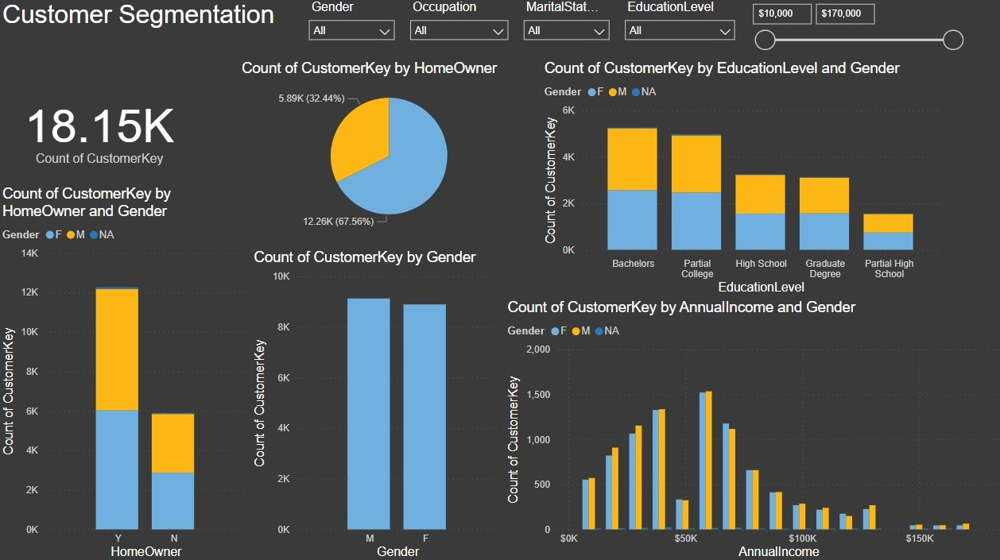
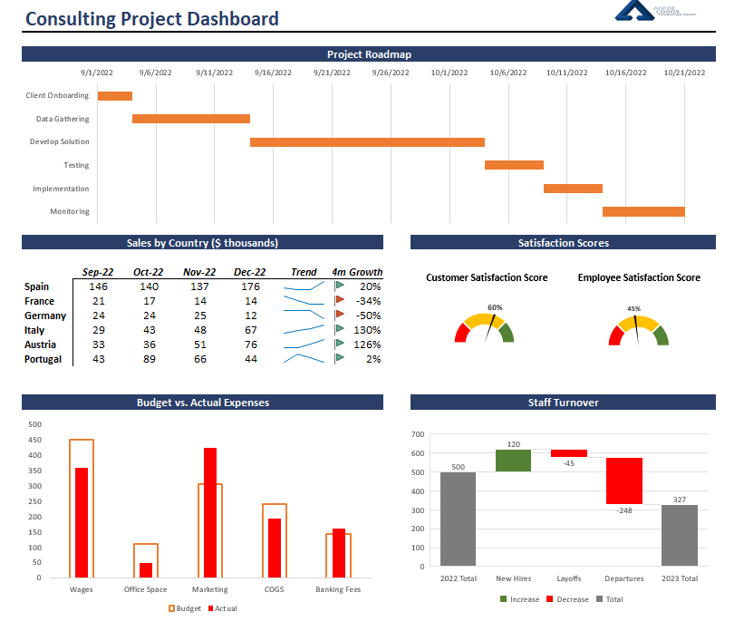
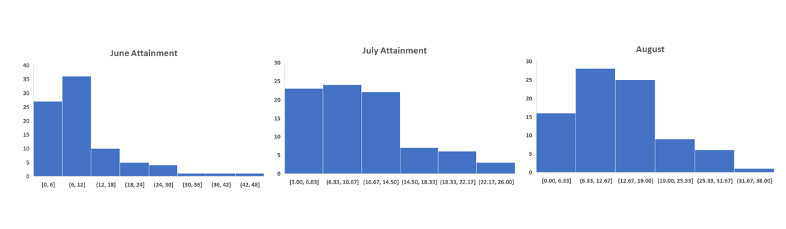

<!DOCTYPE HTML>
<!--
	Massively by HTML5 UP
	html5up.net | @ajlkn
	Free for personal and commercial use under the CCA 3.0 license (html5up.net/license)
-->
<html>
	<head>
		<title>Massively by HTML5 UP</title>
		<meta charset="utf-8" />
		<meta name="viewport" content="width=device-width, initial-scale=1, user-scalable=no" />
		<link rel="stylesheet" href="assets/css/main.css" />
		<noscript><link rel="stylesheet" href="assets/css/noscript.css" /></noscript>
	</head>
	<body class="is-preload">

		<!-- Wrapper -->
			

				<!-- Intro -->
					

						<h1>My Portfolio 
						
A showcase of my projects and my abilities.

						<ul class="actions">
							<li><a href="#header" class="button icon solid solo fa-arrow-down scrolly">Continue</a></li>
						</ul>
					

				<!-- Header -->
					<<header id="header">
						
					</header>

				<!-- Nav -->
					<nav id="nav">
						<ul class="links">
							<li class="active"><a href="index.html">Portfolio Samples</a></li>
						</ul>
						<ul class="icons">
							<li><a href="https://www.linkedin.com/in/juan-almonte" class="icon brands fa-linkedin">Linkedin</a></li>
							<li><a href="https://github.com/jalmonte08.github.io" class="icon brands fa-github">GitHub</a></li>
						</ul>
					</nav>

				<!-- Main -->
					

						<!-- Featured Post -->
							<article class="post featured">
								<header class="major">
									<h2><a href="#">JUAN ALMONTE </a></h2> 
									
Welcome to my Data Analysis Portfolio, where I showcase my proficiency 
									in Excel, Power BI, and Tableau. As a data enthusiast, I'm dedicated to 
									transforming raw information into actionable insights that drive informed
									decision-making. 
									 This portfolio is more than a collection of projects; it's a testament to my 
								dedication to harnessing the power of data for strategic advantage. Whether you're
								interested in exploring my data analysis journey, seeking inspiration for your own 
								projects, or looking to collaborate on future endeavors, I invite you to delve into
								the contents of this portfolio. Together, let's unlock the insights that data has 
								to offer and drive positive change through informed decision-making.
<a>
									<ul class="actions special"></ul>
				
									<article>
										<header>
											<h1><a href="#">Customer Segmentation Analysis 
											</a></h1>
								</header>
								
								
By segmenting customers based on homeownership, education, gender, and income, we have gained
								   valuable insights into their preferences and behaviors. This nuanced approach to customer 
								   segmentation equips us to create tailored marketing strategies, product offerings, 
								   and pricing structures. As a result, we can better meet the diverse needs of our customer 
								   segments, maximize customer satisfaction, and drive sustainable business growth.
								    In an increasingly competitive landscape, leveraging these insights is paramount to staying
									 ahead in the market and forging stronger customer relationships.

								<ul class="actions special">
																	</ul>
							</article>

						<!-- Posts -->
							<section class="posts">
								<article>
									<header>
										<h2><a href="#">Worldwide Video Games Sales  </a></h2>
									</header>
									
									
Analyzing global video game sales reveals fascinating insights. The industry's 
										incredible growth is driven by diverse player profiles, allowing for tailored 
										marketing and game design. Telemetry data not only enhances gameplay but also informs
										 developers about player behavior. Monetization strategies, finely tuned with data, 
										 cater to player preferences. Smart acquisition decisions are made by optimizing marketing 
										 budgets based on data-driven predictions. Strategies focused on player retention, informed by
										  analytics, boost loyalty. Careful balancing of in-game elements is achieved through data analysis, 
										  ensuring an enjoyable experience. Staying ahead of market trends with data-driven insights is 
										  crucial for sustained success. Robust cheating detection systems maintain fairness and competitiveness.
										   Predictive analytics prepare the industry for shifts and emerging opportunities. In the world of video 
										   games, data is the key to conquering challenges and leveling up.

									<ul class="actions special">
										
									</ul>
								</article>
								<article>
									<header>
										<h2><a href="#">Comprehensive Business Performance Dashboard 
										</a></h2>
									</header>
									
									
The Comprehensive Business Performance Dashboard provides a panoramic view of our organization's 
										health, allowing us to navigate toward success with precision. It acts as our compass, blending 
										vital elements such as customer satisfaction, employee morale, sales dynamics, budget adherence, 
										and actual expenses onto a single, intuitive map. Through this integrated visualization, we gain the
										 power to plot our course with confidence, ensuring alignment with strategic objectives. As we journey 
										 forward, it becomes evident that the interplay of these factors profoundly impacts our trajectory. 
										 By keeping a vigilant eye on this comprehensive dashboard, we unlock insights that empower us to make
										  informed decisions, optimize resources, and chart a prosperous future.
									.

									<ul class="actions special">
										
									</ul>
								</article>
								<article>
									<header>
										<h2><a href="#">IMDb Movie Insights: Exploring Actors, Years, Writers, and Genres 
									</a></h2>
									</header>
									
									
Analyzing IMDb movie data reveals intriguing insights. Over the years, we've seen the 
										emergence of diverse genres, with a notable surge in recent years. Talented actors, both
										 seasoned and newcomers, have played pivotal roles in bringing these genres to life. Writers,
										  often the unsung heroes, have crafted captivating narratives that keep audiences engaged.
										   Exploring this rich tapestry of data offers a deeper understanding of how cinema has evolved,
										    highlighting the ever-changing landscape of storytelling and the creativity that drives
											 the film industry forward.

									<ul class="actions special">
										
									</ul>
								</article>
								<article>
									<header>
										<h2><a href="#"> Regression Analysis   </a></h2>
									</header>
									
									
The positive correlation between TV advertising costs and sales revenue
									   suggests that as businesses allocate more resources to television advertising 
									   campaigns, they tend to experience higher sales revenue. This insight underscores 
									   the importance of television advertising as an effective means of promoting products
									   or services and driving business growth. Further analysis and optimization of 
									   advertising strategies may provide opportunities for businesses to capitalize on 
									   this positive correlation for enhanced financial performance.

									<ul class="actions special">
									
									</ul>
								</article>
								<article>
									<header>
										<h2><a href="#">Incentive Effectiveness Analysis 
										</a></h2>
									</header>
									
									
Before the incentive program, in June, we were selling an average of 10.98 cell phone lines each day. In July, this number went down slightly to 10.45. But in August, after starting the incentive program, we saw a big increase. We were selling an average of 13.13 mobile phone lines per day. That's a big 27% increase from July to August! So, the program really helped us sell more mobile lines.
										

									<ul class="actions special">
										
									</ul>
								</article>
								<article>
									<header>
										<h2><a href="#">Product Order Summary Dashboard 
										</a></h2>
									</header>
									
									
Our dashboard segments orders into categories and subcategories,
										 streamlining data management. Identifying top-selling products 
										 and monitoring order volumes helps us make informed decisions about 
										 inventory and marketing strategies. Leveraging these insights will
										  drive growth and profitability. 

									<ul class="actions special">

									</ul>
								</article>
								<article>
									<header>
										<h2><a href="#"> Cookies Performance Dashboard   </a></h2>
									</header>
									
									
A performance data dashboard is a tool for tracking and visualizing key 
									    performance indicators (KPIs) and metrics. It offers real-time monitoring, 
										data visualization, customization, and supports data-driven decision-making a
										cross various functions. Dashboards promote transparency, accountability, 
										and continuous improvement, making them valuable assets for organizations.e.

									<ul class="actions special">
									
									</ul>
								</article>
								<article>
									<header>
										<h2><a href="#">Incentive Effectiveness Analysis 
										</a></h2>
									</header>
									
									
Before the incentive program, in June, we were selling an average of 10.98 cell phone lines each day. In July, this number went down slightly to 10.45. But in August, after starting the incentive program, we saw a big increase. We were selling an average of 13.13 mobile phone lines per day. That's a big 27% increase from July to August! So, the program really helped us sell more mobile lines.
										

									<ul class="actions special">	
																			</ul>
								</article>
							</section>

					

				<!-- Footer -->
					<footer id="footer">
											</section>
						<section class="split contact">
							<section class="alt">
								<h3>Address</h3>
								
Miami, FL 

							</section>
							<section>
								<h3>Email</h3>
								
<a href="#">jalmonte08@gmail.com</a>

							</section>
							<section>
								<h3>Social</h3>
								<ul class="icons alt">
									<li><a href="https://www.linkedin.com/in/juan-almonte" class="icon brands fa-linkedin">Linkedin</a></li>
							        <li><a href="https://github.com/jalmonte08.github.io" class="icon brands fa-github">GitHub									</a></li>
																	</ul>
							</section>
						</section>
					</footer>

				<!-- Copyright -->
					

						<ul><li>&copy; Untitled</li><li>Design: <a href="https://html5up.net">HTML5 UP</a></li></ul>
					

			

		<!-- Scripts -->
			
			
			
			
			
			
			

	</body>
</html>
